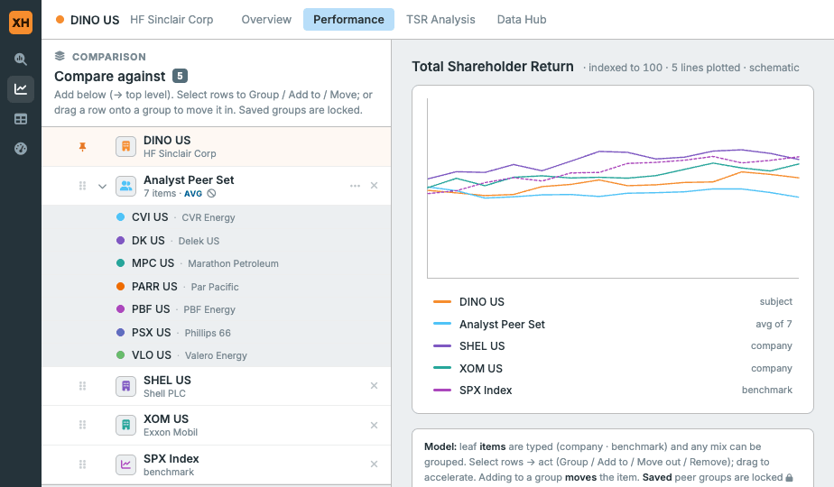
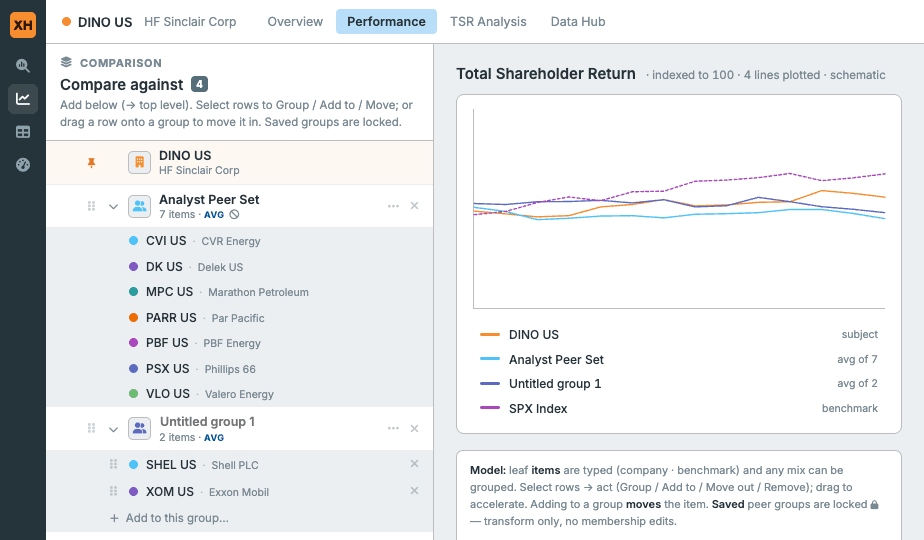
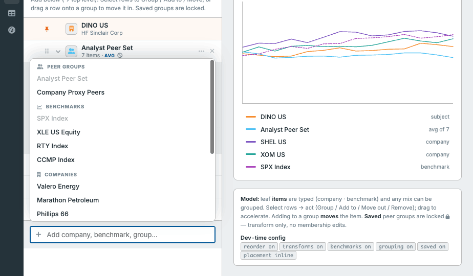
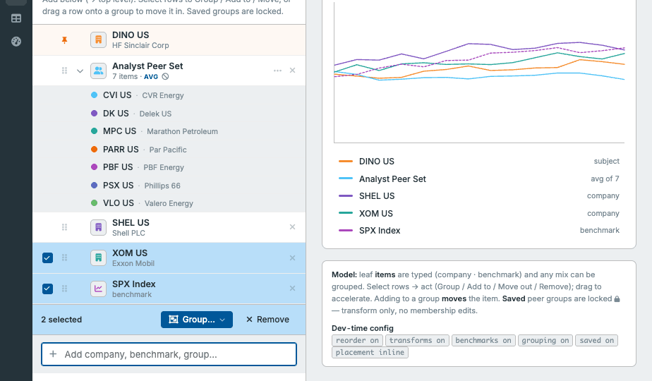
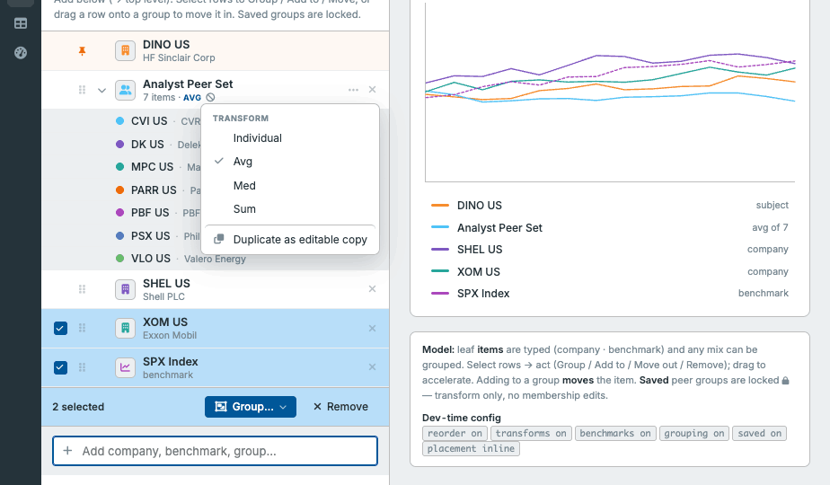

# GroupedItemChooser — Behavioral &amp; Visual Spec

> **Source of truth.** This spec is transcribed from the reviewed, approved interactive demo
> **`Compare Builder.dc.html`** (built in Claude Design; a self-contained copy travels with this
> package at [`assets/reference-demo.html`](assets/reference-demo.html), and curated state PNGs are
> in [`assets/states/`](assets/states/)). Where this document and the demo ever disagree, **the
> demo governs** — re-open it and match it. The older `Comparison Picker Concepts.dc.html` is
> unreviewed exploration and is **not** authoritative.

> **How to read this doc.** It captures *product behavior* and *visual/interaction nuance* only —
> the things the framework can't infer. It deliberately says **nothing** about *how* to build this
> in Hoist (MobX, `hoistCmp`, local models, file layout, styling mechanics). For all of that, defer
> to the Hoist reference — see [`README.md`](README.md) → "Conventions are delegated." Prime
> structural precedent: **`GroupingChooser`** (`cmp/grouping` + `desktop/cmp/grouping`).

The names below (`GroupedItemChooser`, kinds, transforms, groups, anchor) are the generic vocabulary.
Finance labels in the demo (companies, benchmarks, peer groups, tickers) are **sample data only** —
see [`api.md`](api.md) for the domain-neutral API these map onto.

---

## 1. What it is

An interactive control for **assembling and organizing a comparison set**: the user builds an
ordered list whose entries are either **leaf items** or **groups** of items, optionally assigns a
**transform** to each group, and orders everything. The control's backing model emits this as a
structured, ordered `value`. It does **no data computation and no plotting** — a chart/legend is only
an *example consumer* of the value and is **out of scope** (see [`README.md`](README.md) → Boundary).

---

## 2. Anatomy

Top to bottom, the panel body is:

1. **The list** — an ordered column of **entry rows** (leaf items and groups). Groups expand to
   reveal **member rows**, an **"Add to this group…"** row, and an in-group typeahead picker.
2. **Selection action bar** — appears only while a selection is active.
3. **Add field** — an always-present typeahead at the bottom; focus opens a sectioned dropdown.

### 2.1 Entry row (top level)

Left → right, each slot is fixed-width so rows align into columns:

| Slot | Contents | Rules |
|---|---|---|
| **Select** | Checkbox | Hover-reveal (hidden at rest, appears on row hover; stays visible when checked). Omitted entirely when grouping is off. **Never shown on the anchor.** |
| **Lead** | Pin **or** grip | Anchor → a pin icon. Any other row → a drag **grip**, shown only when reordering is enabled. |
| **Caret** | Expand/collapse chevron | Groups only (right = collapsed, down = expanded). Non-groups render an empty spacer of equal width so names stay aligned. |
| **Icon** | Kind/group icon chip | A small rounded chip (~23px, alt-surface fill, hairline border). The glyph is tinted with the entry's **series color**. See [§6](#6-icons--color). |
| **Name** | Name + meta | Name in heading weight. Ad-hoc group names are an **inline-editable** field; all other names are static. Meta line below/next shows a sub-label (item detail, or "N items" for a group), the **transform tag** when applicable, and a **read-only** glyph for locked groups. |
| **Right** | "…" menu + remove | The **"…" menu** appears on groups only (structural actions). The **remove "×"** appears on every row **except the anchor**. |

### 2.2 Member row (inside an expanded group)

Indented under its group. Slots: hover-reveal **checkbox** (only when the group is editable) ·
**grip** (editable + reordering on) · **icon+color** (a small colored dot for one demo kind, a short
dashed line for another — in the generic API both are just `getIcon` + `getColor`, see [§6](#6-icons--color))
· **name + sub-label** · **remove "×"** (editable only).

### 2.3 Anchor row

An optional **single pinned item** at the very top (the demo's "subject"). It is **pinned** (pin
icon, faint accent-tinted row background), **not selectable, not removable, not draggable, not
groupable**, and is always forced back to the top if any reorder would displace it. Purely optional —
apps that don't need a focal item omit it.

---

## 3. Interactions

### 3.1 Adding (bottom typeahead → always lands at top level)

- The add field is always present. **Focus opens** the dropdown; typing filters it live.
- The menu is **sectioned by source**, one section per configured leaf **kind**, plus a section for
  selectable **provided groups**. The demo's sections are *Peer groups*, *Benchmarks*, *Companies*.
- Each section header carries the kind's **type-level icon** (no color here — see [§6](#6-icons--color)).
- Options already present in the comparison are **dimmed and inert**.
- Choosing an option **adds it at the top level** (a new leaf entry, or a copy of a provided group),
  assigns it the **next color** from the allocator, and closes the menu.

### 3.2 Selecting &amp; the action bar

- Clicking a checkbox toggles selection. **Leaf items and members can be co-selected** (mixed
  selection across levels is allowed). Groups themselves are also selectable.
- While anything is selected, the **action bar** shows `{n} selected` and context actions:
  - **Group…** (primary) — shown when ≥1 *item* (leaf or member) is selected and no *group* is in
    the selection. Opens a small **"Group into"** popup listing **"New group…"** plus each existing
    **editable** group. Choosing "New group…" gathers the selection into a fresh user-defined group;
    choosing an existing group moves the selection into it. *(You can make a group of one; a helper
    hint nudges the user to select one more, but it is not required.)*
  - **Move out** — shown when ≥1 *member* is selected; promotes those members up to the top level.
  - **Remove** — removes the selected entries/members.
- Selecting a **group** row + Remove deletes that group.

### 3.3 Group structural "…" menu

On a top-level group, the "…" opens a structural menu (kept deliberately separate from the action
bar, no overlap):

- **Transform** section — the full transform list including **"Individual"** (= no transform / show
  members), with a check on the current selection. Omitted entirely when no transforms are configured.
- Then exactly one of:
  - **Duplicate as editable copy** — on **locked/provided** groups. Inserts a user-defined copy
    right below, sharing the same members (this is *why* the same item may live in two containers —
    see [§5](#5-membership--ordering)).
  - **Ungroup (to top level)** — on **editable** groups. Spills members back to top level.

### 3.4 Adding members to a group

Editable, expanded groups show an **"Add to this group…"** row that toggles an **in-group
typeahead** (its own search + kind sections, excluding items already in that group). Choosing an
option **adds it to the group**; if the item existed as a loose top-level row it is removed from the
top level, but it is **not** removed from any *other* group it belongs to.

### 3.5 Transforms

- A transform is **per-group**, seeded on creation by a configurable default. It is set via the "…"
  Transform section.
- An active non-"Individual" transform surfaces as a small **tag** on the group's meta line
  (the demo shows a short label like `· AVG`).
- **"Individual" = null transform = show members.** The component never computes the transform; it
  only records the selected key in `value`. See [`api.md`](api.md) → Transforms.

### 3.6 Drag &amp; drop

Reordering (when enabled) and relocation share one DnD system:

- **Top-level rows** — drag onto another top-level row to **reorder**; drag onto an editable group
  row to **move the item into that group** (a distinct "nest" affordance, see below). The anchor is
  never reorderable and is always snapped back to the top.
- **Member rows** (editable groups only):
  - onto another member **in the same group** → **reorder within the group**;
  - onto a **different** group → **move** to that group;
  - dropped onto the list background (outside any group) → **promote to top level**.
- **Drop affordances:** a reorder/insert target shows an **inset top border** in the primary intent;
  a "nest into group" target shows an **inset ring + highlighted background**. The dragged row dims.
- **Locked/provided groups reject all drops** and their members are not draggable.

---

## 4. Provided vs. user-defined groups

Two group origins, and the distinction is core:

| | **Provided** (host-supplied) | **User-defined** (ad-hoc) |
|---|---|---|
| Created by | The app, via config | The user, in-session |
| Membership | **Locked** — immutable in the component | Fully editable (add/remove/reorder/move) |
| Name | Static | Inline-editable |
| Transform | **Editable** (transform is always allowed, even when membership is locked) | Editable |
| "…" menu offers | **Duplicate as editable copy** | **Ungroup** |
| Visual cue | Read-only glyph on the meta line; members render without checkbox/grip/remove | — |

To change a provided group you **duplicate it to an editable copy** and edit that — there is no
silent "locally modified" third state. The demo ships with one provided group expanded so its locked
treatment is visible by default.

---

## 5. Membership &amp; ordering

- **Per-container uniqueness.** An item is unique *within* each group and *within* the top-level set
  — nothing more. **The same item may appear in multiple groups and/or at the top level
  simultaneously.** This is intentional (overlapping cohorts) and is required by duplicate-to-edit.
- **The component never dedupes and never computes.** If the same item recurs across several
  no-transform groups, that recurrence flows straight into the emitted ordering; the **consuming app**
  decides whether/how to dedupe or aggregate.
- **Ordering is user-controlled and is part of the output**, at both levels: the order of top-level
  entries, and the order of members within each group. When a group has **no** transform (shows
  members), that member order is significant to the flattened output.
- **Auto-cleanup:** a group whose last member is removed (or moved away) is **auto-removed**. A
  one-member group is **left as a group** (it does *not* collapse to a bare item — the demo keeps it).

See [`api.md`](api.md) → "Observable value" for the exact emitted shape.

---

## 6. Icons &amp; color

One resolution path; **no separate "swatch" concept** — the member dot and the benchmark dash are
just icons with a color, resolved the same way as the top-level chip glyph. Only render *size/weight*
differs by level.

- **Icon = structure** ("what a node is / where it sits"). Resolved via an optional app callback
  **`getIcon(node)`**:
  - **Items** have a **type-level base** `icon` on their kind. `getIcon` overrides per node; if not
    supplied (or it returns nothing) the kind's base icon is used. The kind's base icon is **also the
    sole icon source in the add-menu**, where callbacks never fire and **no color** is shown.
  - **Groups are callback-only** — there is no `group.icon` field. With no callback, groups render
    **icon-less by default**, which is fine.
  - **`getIcon` returning null/undefined omits the icon element entirely** for *any* node (no reserved
    empty square — the slot is not a control surface).
- **Color = series identity** ("which line/bar this maps to"), deliberately **decoupled from
  kind/level**. Resolved via optional **`getColor(node)`**, backed by a **model-bound pooled color
  allocator**: colors are drawn from a developer-supplied palette, **keyed to stable series identity**
  (so reordering never recolors), and **returned to the pool when a series is removed**. Color is
  **single-surfaced** (nodes only — never in the add-menu) and is **emitted in `value`** so the
  control's own icons and the consumer's viz agree on which color is which series.
- **Aggregate hint:** a transform may carry `isAggregate`. It changes no computation and does not
  hide members; it is consumed **only by the default `getColor`**, which for an aggregate group colors
  the *group* as the series and mutes member colors. Apps that supply their own `getColor` ignore it.

Full types and the node-context shapes passed to the callbacks are in [`api.md`](api.md) → "Icons &amp; color".

---

## 7. Placement (display mode)

The identical body renders in two placements, chosen by a prop:

- **Inline** — a docked panel in a side column, with a header ("COMPARISON / Compare against
  `[badge]`") and a one-line usage hint.
- **Popover** — the panel floats from a trigger button ("Compare `[n]` ▾") in a toolbar; the rest of
  the view uses the full width. Rounded corners, drop shadow, scroll-capped list.

Precedent for the popover/inline split and the trigger-button pattern: **`GroupingChooser`**.

---

## 8. Dev-time configuration (what the demo exposes)

The demo surfaces these toggles (shown as chips in its footer). They map to the generic props in
[`api.md`](api.md); here is what each *does behaviorally*:

| Demo flag | Behavior | Generic prop |
|---|---|---|
| `reorder` | Show grips; allow drag-reorder at both levels | `enableReordering` |
| `transforms` | Enable the transform feature (menu + tag) | non-empty `transforms` library |
| `benchmarks` | Include the benchmark **kind** | *(demo-only kind; not an API flag — kinds are injected)* |
| `grouping` | Enable grouping (checkboxes, action bar, nesting) | `enableGrouping` |
| `saved` | Offer provided groups in the add-menu | presence of `providedGroups` |
| `placement` | inline vs popover | `displayMode` |

---

## 9. Styling &amp; tokens

**Do not port the demo's CSS.** Rebuild the visuals with Hoist's own components (Panel, Grid/rows,
Icon, Button, Select, Popover, Toolbar, Badge) and their defaults; reach for `--xh-*` variables only
where you need to match a specific value. The demo used these tokens — treat as the palette to match,
not literals to hardcode:

| Role | Token(s) |
|---|---|
| Surfaces | `--xh-bg`, `--xh-bg-alt` (members/add area), `--xh-bg-highlight` (selected / hover-nest) |
| Borders | `--xh-border-color`, `--xh-grid-border-color` (row dividers) |
| Text | `--xh-text-color`, `--xh-text-color-headings`, `--xh-text-color-muted`, `--xh-text-color-accent` |
| Primary intent | `--xh-intent-primary`, `--xh-intent-primary-text-color` (drop indicators, selected box, primary button) |
| Danger intent | `--xh-intent-danger-text-color` (remove hover, destructive menu items) |
| Anchor accent | `--xh-brand-orange`, `--xh-brand-orange-deep` (pin, subject tint) |
| Type | `--xh-font-family`, `--xh-font-family-mono` (tickers/codes) |
| Hover | `--xh-grid-bg-hover`, `--xh-button-bg` |

Density notes to preserve: **4px** corner radius throughout; hairline 1px borders; row dividers
between entries; members on the alt surface and indented; hover-reveal checkboxes; tabular figures
for any numerics. Casing: **Title Case** for buttons/menu actions/section headers is fine, but the
demo used small UPPERCASE letter-spaced labels for the dock header and menu section headers
(`PEER GROUPS`, `TRANSFORM`, `GROUP INTO`) — keep those.

### Icon glyphs used (map to Hoist `Icon` factories, not raw FA)

group `fa-user-group` · leaf kinds `fa-building` / `fa-chart-line` (demo) · anchor pin `fa-thumbtack`
· grip `fa-grip-vertical` · caret `fa-chevron-down`/`-right` · check `fa-check` · menu `fa-ellipsis`
· remove `fa-xmark` · group/ungroup `fa-object-group`/`fa-object-ungroup` · duplicate `fa-clone` ·
move-out `fa-arrow-up-from-bracket` · transform `fa-calculator` / individual `fa-align-left` · add
`fa-plus` · search `fa-magnifying-glass` · read-only lock (demo used `fa-ban` as a Free-tier stand-in;
production wants a "no-edit" glyph such as `fa-pen-slash`). Use the framework's `Icon` singleton; do
not hand-pick FA classes.

---

## 10. Edge cases &amp; details to preserve

- **Anchor** never selectable/removable/draggable/groupable; snapped to top on any reorder.
- **Empty group** (last member removed or moved) → auto-removed. **One-member group** stays a group.
- **Locked/provided group** rejects drops; members have no checkbox/grip/remove; transform still editable.
- **Add-menu** dims already-present options; shows a "no matches" empty state when a query matches nothing.
- **In-group picker** excludes items already in that group; shows an "everything's already here" empty state.
- **"Group…"** needs ≥1 selected item and no group in the selection; a one-item selection is allowed
  (with a gentle "select one more" hint). **"Move out"** needs ≥1 selected member.
- **Popover mode** scroll-caps the list and nudges the in-group picker into view when it would clip.
- A closing **scrim** dismisses any open menu/popup on outside click.
